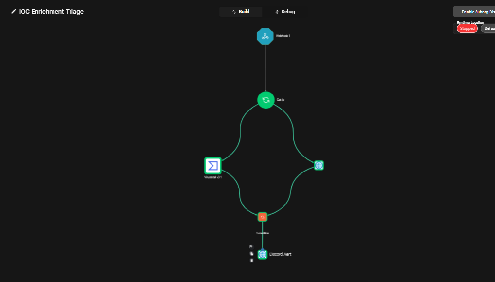
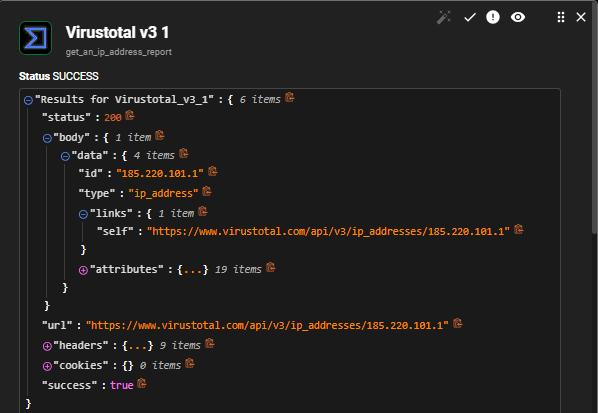
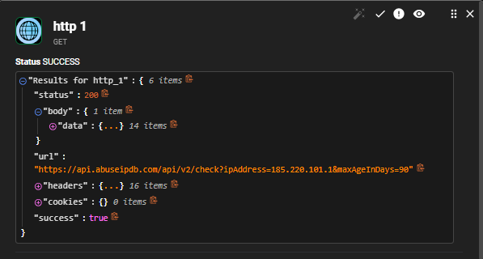
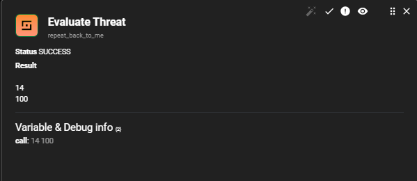
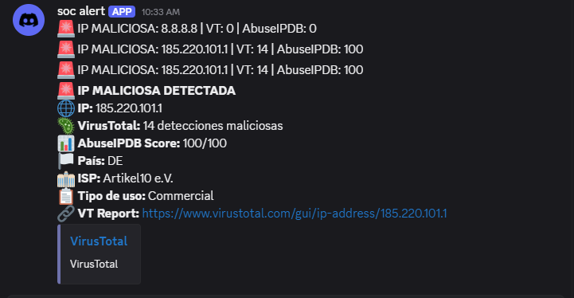
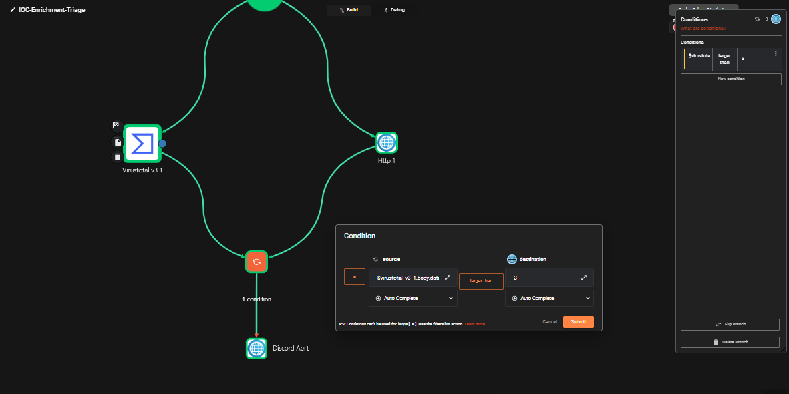
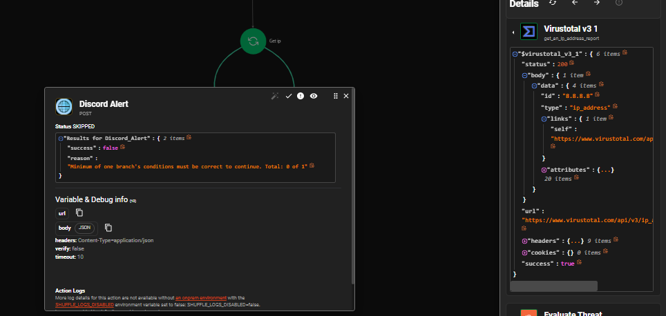
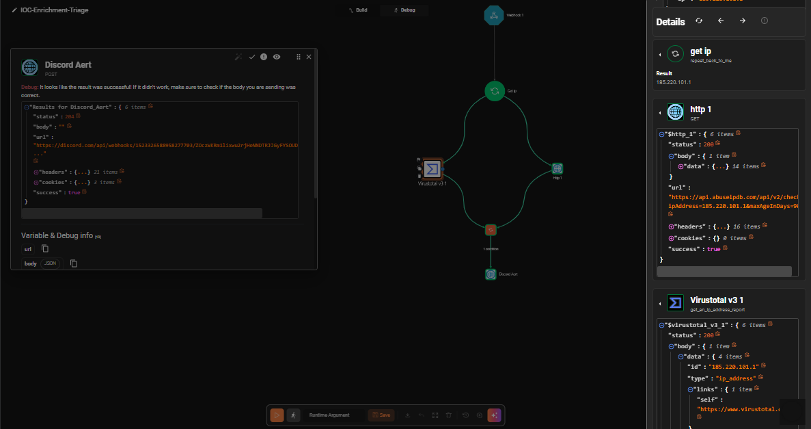
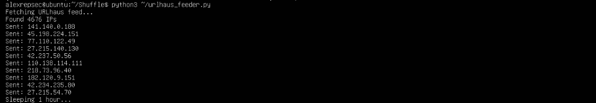

Claude terminó la respuesta
Funciona perfecto! podemos continuar con las siguientes fases

¡Excelente! 🎉 El pipeline completo está funcionando:

✅ Webhook manual → enriquecimiento → alerta Discord
✅ URLhaus feed automático → enriquecimiento → alerta Discord
✅ Filtro VirusTotal > 3 detecciones
✅ Mensaje enriquecido con IP, país, ISP, tipo de uso, link VT

Ahora documentamos — README para portafolio
Vamos a crear un README profesional. En la VM:

bash
cat > ~/Shuffle/README.md << 'EOF'
EOF
Pero mejor usa nano para evitar el problema de heredoc anterior:

bash
nano ~/Shuffle/README.md
Pega esto:

markdown
# IOC Enrichment & Triage SOAR

Automated threat intelligence pipeline built with Shuffle SOAR.

## Architecture
Webhook / URLhaus Feed → IP Enrichment → Triage → Discord Alert

## Components
- **Shuffle SOAR** — workflow orchestration
- **VirusTotal API v3** — malicious detection count
- **AbuseIPDB API v2** — abuse confidence score
- **URLhaus Feed** — automated malicious IP ingestion
- **Discord Webhook** — real-time alerts

## Alert Criteria
Triggered when VirusTotal detections > 3

## Alert Format
- IP address
- VirusTotal detections
- AbuseIPDB score
- Country & ISP
- Direct VT report link

## Infrastructure
- Ubuntu 24.04 LTS on VMware
- Shuffle SOAR via Docker Compose
- Python feeder script for URLhaus automation
Guarda con Ctrl+O → Enter → Ctrl+X.

¿Quieres que hagamos el README más detallado con diagramas ASCII del flujo y capturas de pantalla referenciadas?


Wazuh-SIEM-Homelab ✅ Objective This project demonstrates the deployment of a Wazuh SIEM (Security Information and Event Management) in a home lab environment using VMware Workstation. The lab covers the full setup of a Wazuh Manager on Ubuntu Server, agent deployment on a Windows 11 host, and real

pasted

Aqui te comparti una estructura de README.md, dame una similar en base al proyecto que hicimos. Dame una lista de capturas para cambiarles el nombre, luego te las comparto para que las agregues al README.md

Perfecto, veo el estilo del README de Wazuh. Aquí está la lista de capturas que necesito que me compartas:

Capturas necesarias — renómbralas así:
1. workflow-canvas.png        → Canvas completo del workflow en Shuffle
2. virustotal-success.png     → Debug de VirusTotal con status 200
3. abuseipdb-success.png      → Debug de Http 1 (AbuseIPDB) con status 200
4. evaluate-threat.png        → Evaluate Threat mostrando 14 y 100
5. discord-alert-simple.png   → Primer mensaje de Discord (IP maliciosa)
6. discord-alert-enriched.png → Mensaje enriquecido con país, ISP, link VT
7. discord-filter.png         → Discord mostrando que 8.8.8.8 NO generó alerta
8. urlhaus-terminal.png       → Terminal con el script corriendo (Sent: X.X.X.X)
9. shuffle-debug-full.png     → Panel Details completo con todos los nodos verdes
10. condition-setup.png       → Modal de condición en la flecha Evaluate→Discord
Toma las capturas en Shuffle y Discord, renómbralas exactamente así, y compártelas aquí. Con esas imágenes armo el README completo en el mismo estilo profesional que el de Wazuh.

Captura de pantalla 2026-07-05 152518.png
Una pregunta, quieres esta captura como la de el discord filter?

Sí, esa captura es perfecta para discord-filter.png — muestra que 8.8.8.8 llegó al Discord pero con VT: 0 y AbuseIPDB: 0.

Aunque idealmente queremos mostrar que 8.8.8.8 fue bloqueada y no generó alerta. Esa captura muestra que sí llegó un mensaje para 8.8.8.8, lo cual ocurrió antes de que configuráramos el filtro.

Tienes dos opciones:

Usar esa captura igual — en el README la explicamos como "prueba de que IPs limpias tienen score 0, el filtro las bloquea en runs posteriores"
Tomar una nueva captura del Debug de Shuffle mostrando Discord Alert con Status SKIPPED para 8.8.8.8 — eso es más impactante visualmente para el portafolio.
¿Cuál prefieres?

abuseipdb-success.png
condition-setup.png
discord-alert-enriched.png
discord-alert-simple.png
discord-filter.png
evaluate-threat.png
shuffle-debug-full.png
urlhaus-terminal.png
virustotal-success.png
workflow-canvas.png
Listo, aqui tienes las capturas con nombres, dame el README.md

Perfecto, tengo todas las capturas. Voy a crear el README.md ahora.


Archivo visualizado, creó un archivo, archivo leído
Archivo visualizado, creó un archivo, archivo leído
El README está listo. Incluye:

Arquitectura completa con diagrama ASCII
Tabla de tecnologías usadas
Specs de la VM
Los 9 pasos documentados con cada captura referenciada
Tabla de retos técnicos y soluciones — esta sección es valiosa para un portafolio porque muestra capacidad de troubleshooting
Estructura del proyecto
El script de URLhaus documentado
Para usarlo en GitHub, crea un repositorio llamado IOC-Enrichment-Triage y sube el README junto con la carpeta screenshots/ con las 10 imágenes. ¿Quieres ayuda con eso o continuamos con alguna mejora al proyecto?


Readme
Documento · MD 

Este chat tiene 98 de 100 imágenes (incluidas las páginas de PDF). Considera iniciar un nuevo chat.


Claude es IA y puede cometer errores. Por favor, verifica nuevamente las respuestas.


Readme · MD
# IOC-Enrichment-Triage SOAR
 
✅ **Objective**
 
This project demonstrates the deployment of an automated **IOC (Indicator of Compromise) Enrichment and Triage pipeline** built on Shuffle SOAR in a home lab environment. The pipeline receives IP addresses via webhook or automated feed, enriches them with threat intelligence from VirusTotal and AbuseIPDB, evaluates their threat level, and delivers real-time alerts to a Discord channel — with smart filtering to suppress false positives.
 
---
 
## Skills Learned
 
- Deploying and configuring Shuffle SOAR using Docker Compose on Ubuntu 24.04
- Designing multi-node SOAR workflows with parallel API enrichment
- Integrating threat intelligence APIs (VirusTotal v3, AbuseIPDB v2) into automated pipelines
- Implementing conditional branching in SOAR workflows for triage logic
- Building automated IOC ingestion from URLhaus threat feeds using Python
- Sending real-time enriched security alerts to Discord via webhook
- Troubleshooting variable scoping, API authentication, and workflow execution in Shuffle
---
 
## 🧰 Technologies Used
 
| Tool | Purpose |
|---|---|
| Shuffle SOAR | Workflow orchestration platform |
| VirusTotal API v3 | IP reputation — malicious engine detections |
| AbuseIPDB API v2 | IP abuse confidence scoring |
| URLhaus (abuse.ch) | Automated malicious IP feed |
| Discord Webhook | Real-time alert delivery |
| Python 3 | URLhaus feed automation script |
| Docker Compose | Shuffle deployment |
| Ubuntu 24.04 LTS | VM host OS |
| VMware Workstation | Virtualization platform |
 
---
 
## ⚙️ Environment Setup
 
### Virtual Machine Specifications
 
| Parameter | Value |
|---|---|
| OS | Ubuntu 24.04 LTS |
| RAM | 4 GB |
| CPU | 2 cores |
| Network | VMware NAT — Static IP |
| IP Address | 192.168.253.128 |
| Shuffle URL | https://192.168.253.128:3443 |
 
### Prerequisites
 
- VMware Workstation installed
- Ubuntu 24.04 LTS ISO
- Docker and Docker Compose installed
- VirusTotal API key (free tier)
- AbuseIPDB API key (free tier)
- Discord server with a webhook-enabled channel
---
 
## 🏗️ Lab Architecture
 
```
┌─────────────────────────────────────────────────────────────────┐
│                        HOST MACHINE                              │
│                      Windows 11 Pro                              │
│                                                                  │
│   ┌──────────────────┐         ┌──────────────────────────────┐ │
│   │  Manual Testing  │         │   Discord — #soar channel    │ │
│   │  curl / webhook  │         │   Real-time IOC alerts       │ │
│   └────────┬─────────┘         └──────────────────────────────┘ │
│            │                                    ▲                │
│            ▼              VMware NAT             │                │
│   ┌──────────────────────────────────────────────────────────┐  │
│   │               VMware Virtual Machine                      │  │
│   │               Ubuntu 24.04 LTS                            │  │
│   │               IP: 192.168.253.128                         │  │
│   │                                                            │  │
│   │   ┌────────────────────────────────────────────────────┐  │  │
│   │   │              Shuffle SOAR (Docker)                  │  │  │
│   │   │                                                      │  │  │
│   │   │  Webhook → get ip → VirusTotal ──┐                  │  │  │
│   │   │                  → AbuseIPDB  ──► Evaluate ──► Discord│  │  │
│   │   └────────────────────────────────────────────────────┘  │  │
│   │                                                            │  │
│   │   ┌──────────────────────────────────┐                    │  │
│   │   │  urlhaus_feeder.py (Python)       │                    │  │
│   │   │  Fetches URLhaus feed every hour  │                    │  │
│   │   │  Sends IPs to Shuffle webhook     │                    │  │
│   │   └──────────────────────────────────┘                    │  │
│   └──────────────────────────────────────────────────────────┘  │
└─────────────────────────────────────────────────────────────────┘
```
 
---
 
## 🔁 Workflow Design
 
### Node Structure
 
| Node | Type | Role |
|---|---|---|
| Webhook 1 | Trigger | Receives `{"ip": "x.x.x.x"}` payload |
| get ip | Shuffle Tools | Extracts IP from webhook payload via `$exec.ip` |
| Virustotal v3 1 | VirusTotal App | Queries IP report — returns malicious engine count |
| Http 1 | HTTP GET | Queries AbuseIPDB — returns abuse confidence score |
| Evaluate Threat | Shuffle Tools | Aggregates VT detections + AbuseIPDB score |
| Discord Aert | HTTP POST | Sends enriched alert to Discord webhook |
 
### Triage Condition
 
Alerts are only sent when:
```
VirusTotal malicious detections > 3
```
 
This filters out benign IPs like 8.8.8.8 and reduces noise.
 
---
 
## 🚀 Step 1 — Shuffle Deployment
 
Shuffle was deployed using Docker Compose on Ubuntu 24.04. Memory settings were tuned to fit within a 4GB VM:
 
```bash
cd ~/Shuffle
# Edit docker-compose.yml — set OpenSearch heap to 512MB
# OPENSEARCH_JAVA_OPTS=-Xms512m -Xmx512m
 
# Set required kernel parameter
echo "vm.max_map_count=262144" | sudo tee -a /etc/sysctl.conf
sudo sysctl -p
 
sudo docker compose up -d
```
 
---
 
## 🔁 Step 2 — Workflow Canvas
 
The complete IOC-Enrichment-Triage workflow in Shuffle SOAR:
 

 
---
 
## 🦠 Step 3 — VirusTotal Enrichment
 
VirusTotal v3 API queries the IP and returns the full analysis report including malicious engine detections:
 

 
---
 
## 🔴 Step 4 — AbuseIPDB Enrichment
 
AbuseIPDB v2 is queried via a generic HTTP node with the API key passed as a header (`Key: YOUR_API_KEY`):
 

 
> **Note:** The native AbuseIPDB v2 Shuffle app returns status 422 due to incorrect header handling. Using a generic HTTP node resolves this.
 
---
 
## ⚖️ Step 5 — Threat Evaluation
 
The Evaluate Threat node aggregates both API results into a single output for triage:
 

 
For IP `185.220.101.1` (known Tor exit node):
- **VirusTotal:** 14 malicious detections
- **AbuseIPDB Score:** 100/100
---
 
## 🔔 Step 6 — Discord Alerts
 
### Initial Alert
 
First working alert delivered to Discord:
 

 
### Enriched Alert
 
Full enriched alert with country, ISP, usage type, and VT report link:
 

 
Alert format:
```
🚨 IP MALICIOSA DETECTADA
🌐 IP: 185.220.101.1
🦠 VirusTotal: 14 detecciones maliciosas
📊 AbuseIPDB Score: 100/100
🏳️ País: DE
🏢 ISP: Artikel10 e.V.
📋 Tipo de uso: Commercial
🔗 VT Report: https://www.virustotal.com/gui/ip-address/185.220.101.1
```
 
---
 
## 🚦 Step 7 — Triage Filtering
 
The conditional branch between Evaluate Threat and Discord Alert suppresses alerts for benign IPs:
 

 

 
When `8.8.8.8` is submitted — VT: 0, AbuseIPDB: 0 — Discord Alert is **SKIPPED**:
 
```
Status SKIPPED
"Minimum of one branch's conditions must be correct to continue. Total: 0 of 1"
```
 
---
 
## 🌐 Step 8 — Full Pipeline Debug
 
Complete successful execution for `185.220.101.1` showing all nodes green:
 

 
Execution summary:
- **get ip** → Result: `185.220.101.1` ✅
- **Http 1 (AbuseIPDB)** → status 200 ✅
- **Virustotal v3 1** → status 200 ✅
- **Evaluate Threat** → `14 / 100` ✅
- **Discord Aert** → status 204 ✅
---
 
## 🤖 Step 9 — Automated URLhaus Feed
 
A Python script fetches the URLhaus malicious IP feed every hour and sends each IP through the Shuffle pipeline automatically:
 

 
```python
# urlhaus_feeder.py — runs on the VM
# Fetches https://urlhaus.abuse.ch/downloads/csv_recent/
# Extracts IPs from malicious URLs
# Posts each IP to Shuffle webhook
# Processes up to 10 IPs per hour to stay within API limits
```
 
Run the feeder:
```bash
python3 ~/urlhaus_feeder.py &
```
 
---
 
## 📁 Project Structure
 
```
IOC-Enrichment-Triage/
├── screenshots/
│   ├── workflow-canvas.png
│   ├── virustotal-success.png
│   ├── abuseipdb-success.png
│   ├── evaluate-threat.png
│   ├── discord-alert-simple.png
│   ├── discord-alert-enriched.png
│   ├── discord-filter.png
│   ├── shuffle-debug-full.png
│   ├── condition-setup.png
│   └── urlhaus-terminal.png
├── urlhaus_feeder.py
└── README.md
```
 
---
 
## 🔑 Key Technical Challenges Solved
 
| Challenge | Solution |
|---|---|
| AbuseIPDB app returns 422 | Replaced with generic HTTP node using `Key:` header |
| Variable `$exec.ip` not propagating to child nodes | Used `get ip` Shuffle Tools node as startnode; child nodes reference `$get_ip` |
| Shuffle Tools node skipped | Ensured startnode is correctly set and all nodes are under its execution tree |
| URLhaus API requires auth | Used public CSV endpoint instead: `/downloads/csv_recent/` |
| Alert noise from benign IPs | Added conditional branch: VirusTotal detections > 3 |
 
---
 
## 👤 Author
 
**alexrepsec**
Cybersecurity enthusiast | Home Lab Builder | SOAR Developer
 
This project was built as part of a cybersecurity portfolio to demonstrate practical SOAR deployment, threat intelligence integration, and automated IOC triage skills.
 
